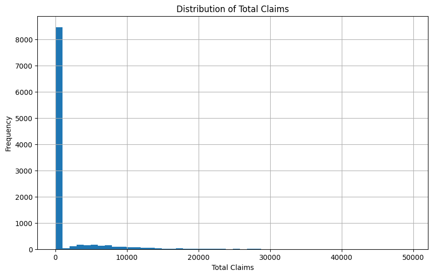
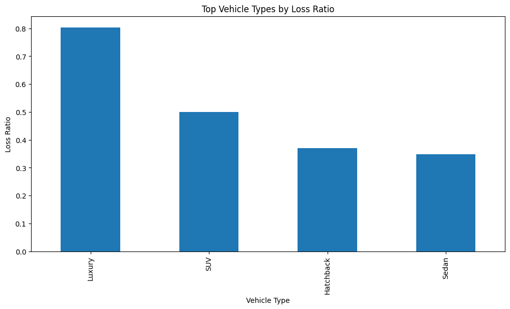

# Insurance Risk Analytics

## Project Overview

This project analyzes historical South African auto insurance data for AlphaCare Insurance Solutions (ACIS). The objective is to identify low-risk customer segments, optimize premium pricing, and support evidence-based marketing and insurance decision-making using exploratory data analysis, statistical testing, and predictive modeling.

The project follows an end-to-end analytics workflow including:

- Exploratory Data Analysis (EDA)
- Data Version Control (DVC)
- Hypothesis Testing
- Predictive Modeling
- Risk-Based Pricing Framework

---

# Business Objective

AlphaCare Insurance Solutions (ACIS) aims to:

- Discover low-risk insurance customers
- Improve profitability through risk-based pricing
- Optimize marketing investments
- Understand claim behavior across provinces, vehicle types, and customer demographics

Key business metrics:

- **Loss Ratio** = TotalClaims / TotalPremium
- **Margin** = TotalPremium − TotalClaims

---

# Project Structure

```bash
insurance-risk-analytics/

├── .github/
│   └── workflows/
│       └── ci.yml
│
├── data/
│   ├── raw/
│   └── processed/
│
├── notebooks/
│   ├── 01_eda.ipynb
│   ├── 02_hypothesis_testing.ipynb
│   └── 03_modeling.ipynb
│
├── scripts/
│   ├── run_eda.py
│   └── dvc_pipeline.py
│
├── src/
│   ├── data_loader.py
│   ├── eda_utils.py
│   ├── hypothesis_tests.py
│   └── modeling.py
│
├── reports/
│   └── interim_report.md
│
├── tests/
│
├── .dvc/
├── requirements.txt
├── dvc.yaml
└── README.md
```

---

# Technologies Used

- Python
- Pandas
- NumPy
- Matplotlib
- Seaborn
- Scikit-learn
- DVC
- Git & GitHub Actions
- Jupyter Notebook

---

# Setup Instructions

## Clone Repository

```bash
git clone https://github.com/Kiyazed/insurance-risk-analytics.git
```

## Navigate into Project

```bash
cd insurance-risk-analytics
```

## Create Virtual Environment

```bash
python -m venv .venv
```

## Activate Environment

### Windows

```bash
.venv\Scripts\activate
```

### Linux/Mac

```bash
source .venv/bin/activate
```

## Install Dependencies

```bash
pip install -r requirements.txt
```

---

# Running EDA

Run the EDA pipeline:

```bash
python -m scripts.run_eda
```

---

# Data Version Control (DVC)

This project uses DVC for reproducible data versioning and pipeline management.

## Initialize DVC

```bash
dvc init
```

## Track Dataset

```bash
dvc add data/raw/insurance_data.csv
```

## Push Data to Local Storage

```bash
dvc push
```

## Pull Data

```bash
dvc pull
```

---

# Exploratory Data Analysis (EDA)

The EDA focused on:

- Descriptive statistics
- Missing value analysis
- Outlier detection
- Geographic risk trends
- Vehicle risk analysis
- Temporal claim patterns
- Loss ratio analysis

### Key Insights

- Certain provinces show significantly higher claim severity.
- Loss ratios vary across vehicle types and customer segments.
- Several extreme outliers exist in TotalClaims and vehicle values.
- Premium and claim values exhibit positive correlation.

---

# Example Visualizations

## Distribution of Total Claims



## Province Risk Analysis


## Premium vs Claims Scatterplot


---

# Continuous Integration (CI)

GitHub Actions automatically runs:

- Code linting
- Unit tests
- Workflow validation

on every push to the repository.

---

# Future Work

Upcoming tasks include:

- Hypothesis Testing
- Claim Severity Modeling
- Risk-Based Premium Prediction
- SHAP Model Interpretability
- Business Recommendation Report

---

# Author

Kiya Zewdu  
10 Academy – Insurance Risk Analytics Project